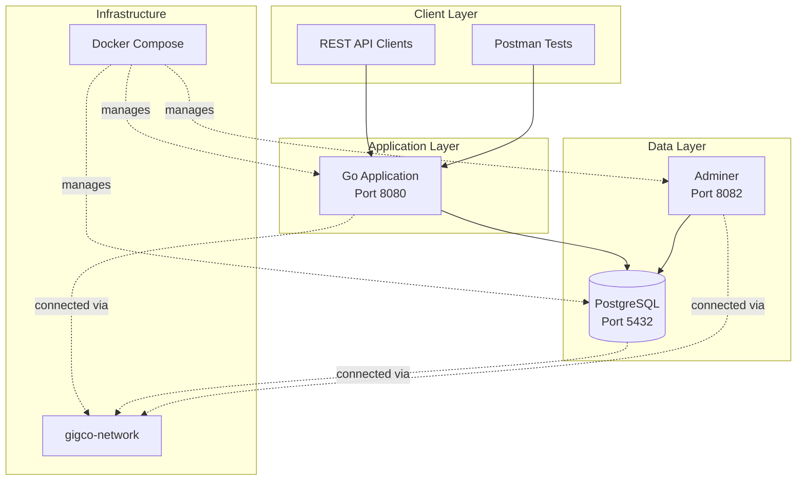
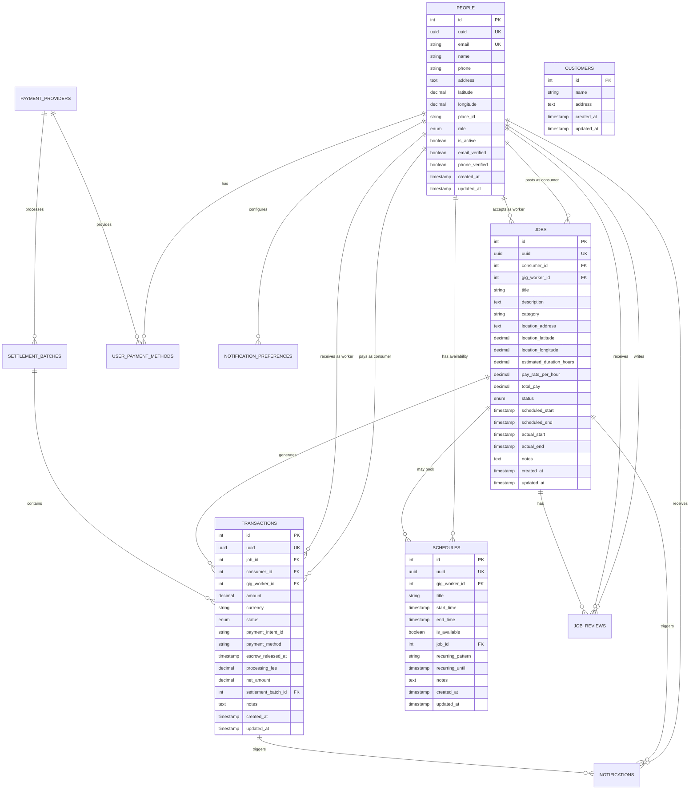
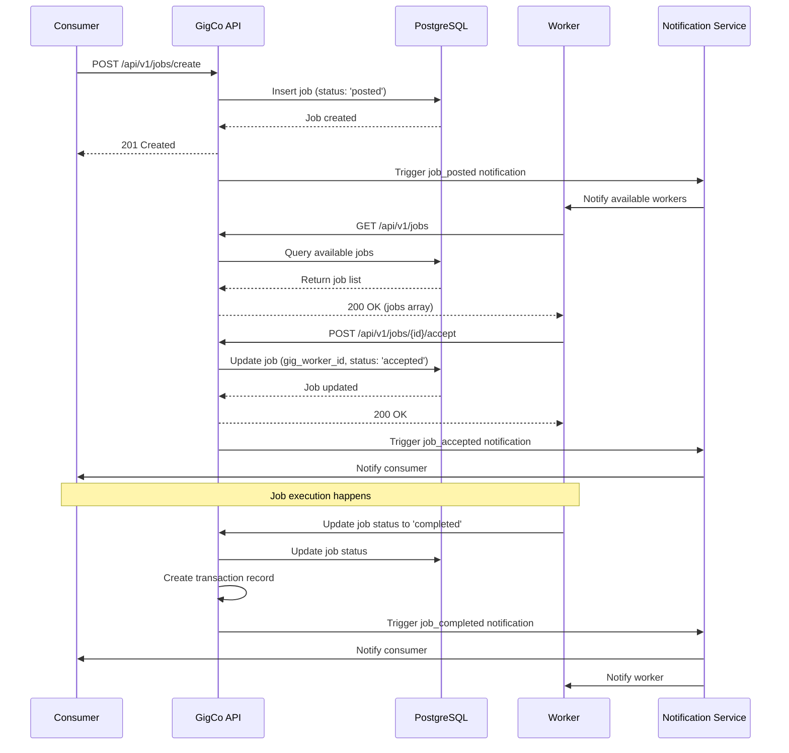
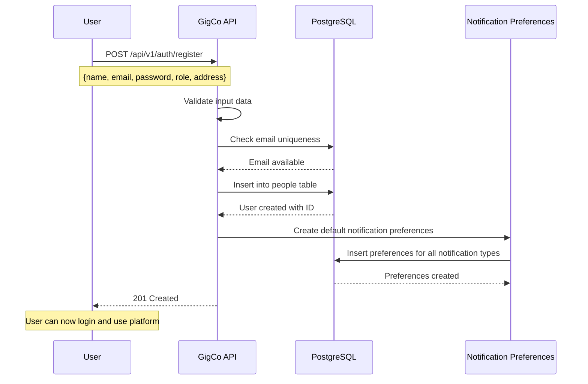
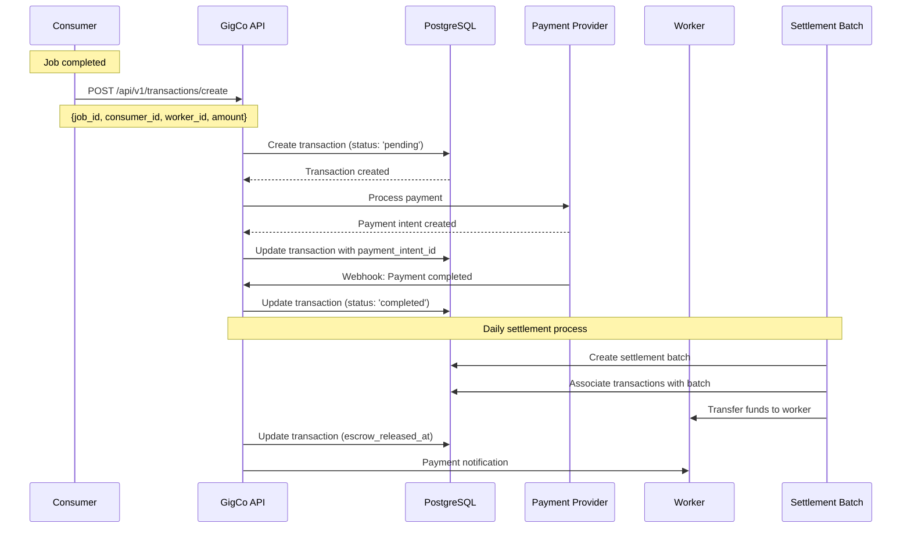

# GigCo Application Architecture Documentation

## Overview

GigCo is a gig economy platform that connects consumers with gig workers for various services. The application is built using a microservices architecture with Docker containerization, featuring a Go-based API backend and PostgreSQL database.

## System Architecture

### High-Level Architecture

## Container Architecture

The application uses Docker Compose to orchestrate three main services:

1. **App Service**: The main Go application
   - Exposed on port 8080
   - Connected to PostgreSQL database
   - Mounts templates directory for views

2. **PostgreSQL Service**: Database server
   - PostgreSQL 17 Alpine version
   - Exposed on host port 5433 (maps to container port 5432)
   - Persistent volume for data storage
   - Health checks configured

3. **Adminer Service**: Database administration tool
   - Web-based database management
   - Exposed on port 8082
   - Connected to PostgreSQL via Docker network

## Database Schema

### Entity Relationship Diagram

### Core Entity Types

The system uses several PostgreSQL ENUM types for data integrity:

- **user_role**: 'consumer', 'gig_worker', 'admin'
- **job_status**: 'posted', 'accepted', 'in_progress', 'completed', 'cancelled'
- **transaction_status**: 'pending', 'completed', 'failed', 'refunded'
- **notification_type**: 'job_posted', 'job_accepted', 'job_completed', 'payment_received', 'system_message'
- **notification_status**: 'unread', 'read', 'archived'

## API Endpoints

Based on the Postman collection, the application exposes the following REST API endpoints:

### Health & Status
- `GET /health` - Application health check
- `GET /` - Email form (legacy endpoint)

### User Management
- `GET /api/v1/customers/{id}` - Get customer by ID
- `POST /api/v1/users/create` - Create new user
- `POST /api/v1/auth/register` - Register new user with authentication

### Job Management
- `GET /api/v1/jobs` - List all jobs
- `GET /api/v1/jobs/{id}` - Get job by ID
- `POST /api/v1/jobs/create` - Create new job
- `POST /api/v1/jobs/{id}/accept` - Accept a job

### Schedule Management
- `POST /api/v1/schedules/create` - Create schedule entry

### Transaction Management
- `POST /api/v1/transactions/create` - Create transaction

## Application Flow Diagrams

### Job Lifecycle Flow

### User Registration Flow

### Payment Transaction Flow

## Security & Infrastructure Considerations

### Network Security
- All services communicate through an isolated Docker network (`gigco-network`)
- Database is not directly exposed to the internet (only through mapped port for development)
- Health checks ensure service availability

### Data Persistence
- PostgreSQL data stored in Docker volume (`postgres_data`)
- Database initialization script runs on first startup
- Automatic timestamps and UUID generation for audit trails

### Environment Configuration
- Environment variables used for database configuration
- SSL mode disabled for local development
- Restart policies ensure service availability

## Development & Testing

### API Testing
The Postman collection provides comprehensive test coverage including:
- Health checks
- CRUD operations for all major entities
- Error handling scenarios
- Response time validation
- Data structure validation

### Database Administration
- Adminer provides web-based database management
- Direct PostgreSQL access available on port 5433
- Health check function available for monitoring

## Scalability Considerations

The current architecture supports several scalability patterns:

1. **Horizontal Scaling**: The stateless Go application can be scaled horizontally behind a load balancer
2. **Database Scaling**: PostgreSQL supports read replicas for scaling read operations
3. **Caching Layer**: Can be added between the application and database
4. **Message Queue**: Can be introduced for asynchronous job processing and notifications
5. **Microservices**: The monolithic application can be broken down into microservices as needed