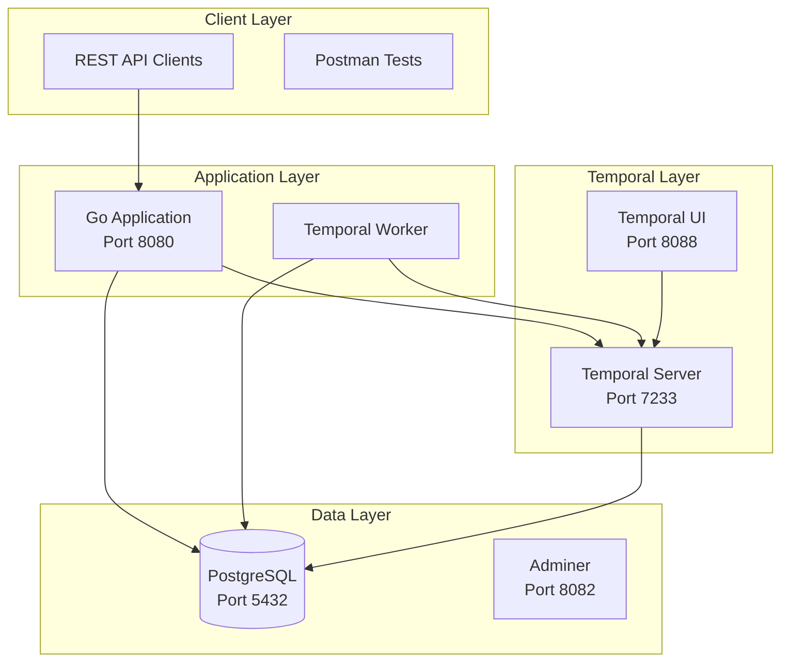

# Using Temporal.io for Workflow Management in GigCo

Temporal.io is specifically designed for complex workflow orchestration and would be a much better choice than building a custom workflow engine. 

## Why Temporal.io is Perfect for GigCo

### Advantages Over Custom Solution

1. **Built-in State Management**: Temporal handles all workflow state persistence automatically
2. **Failure Handling**: Automatic retries, timeouts, and error handling
3. **Long-Running Workflows**: Perfect for job lifecycles that can span days/weeks
4. **Activity Orchestration**: Clean separation of business logic from workflow logic
5. **Visibility**: Built-in UI for monitoring and debugging workflows
6. **Testing**: Comprehensive testing framework for workflows
7. **Scalability**: Battle-tested at companies like Uber, Netflix, and Stripe

### Updated Architecture with Temporal



## Updated Implementation Plan

### Modified Step 1.2: Database Schema Design (Simplified)

Since Temporal handles workflow state, we can simplify our database schema:

````sql
-- No need for workflow tables - Temporal handles this!

-- Just add workflow tracking to entities
ALTER TABLE jobs 
ADD COLUMN temporal_workflow_id VARCHAR(255),
ADD COLUMN temporal_run_id VARCHAR(255);

-- Add indexes for workflow lookups
CREATE INDEX idx_jobs_workflow ON jobs(temporal_workflow_id) WHERE temporal_workflow_id IS NOT NULL;
````

### New Step 1.2.5: Temporal Integration

#### Update Docker Compose

````yaml
services:
  app:
    build: .
    ports:
      - "8080:8080"
    environment:
      - PORT=8080
      - DB_HOST=postgres
      - DB_PORT=5432
      - DB_NAME=gigco
      - DB_USER=postgres
      - DB_PASSWORD=bamboo
      - DB_SSLMODE=disable
      - TEMPORAL_HOST=temporal:7233
    depends_on:
      postgres:
        condition: service_healthy
      temporal:
        condition: service_started
    networks:
      - gigco-network
    volumes:
      - ./templates:/root/templates
    restart: unless-stopped

  temporal-worker:
    build: .
    command: ["./worker"]  # Separate worker process
    environment:
      - DB_HOST=postgres
      - DB_PORT=5432
      - DB_NAME=gigco
      - DB_USER=postgres
      - DB_PASSWORD=bamboo
      - DB_SSLMODE=disable
      - TEMPORAL_HOST=temporal:7233
    depends_on:
      postgres:
        condition: service_healthy
      temporal:
        condition: service_started
    networks:
      - gigco-network
    restart: unless-stopped

  postgres:
    # ... existing postgres config ...

  temporal:
    image: temporalio/auto-setup:1.22.4
    ports:
      - "7233:7233"
    environment:
      - DB=postgresql
      - DB_PORT=5432
      - POSTGRES_USER=postgres
      - POSTGRES_PWD=bamboo
      - POSTGRES_SEEDS=postgres
    depends_on:
      - postgres
    networks:
      - gigco-network
    restart: unless-stopped

  temporal-ui:
    image: temporalio/ui:2.22.3
    ports:
      - "8088:8080"
    environment:
      - TEMPORAL_ADDRESS=temporal:7233
    depends_on:
      - temporal
    networks:
      - gigco-network
    restart: unless-stopped

  admin:
    # ... existing adminer config ...

volumes:
  postgres_data:

networks:
  gigco-network:
    driver: bridge
````

### Temporal Workflow Implementation

#### Job Lifecycle Workflow

````go
package workflows

import (
    "time"
    "go.temporal.io/sdk/workflow"
    "github.com/gigco/app/internal/temporal/activities"
)

// JobWorkflowInput contains the input for a job workflow
type JobWorkflowInput struct {
    JobID      int
    ConsumerID int
}

// JobWorkflowState tracks the current state of the job
type JobWorkflowState struct {
    JobID           int
    CurrentState    string
    PricedAmount    float64
    AssignedWorkerID int
    PaymentID       string
    ReviewsReceived int
}

// JobLifecycleWorkflow orchestrates the entire job lifecycle
func JobLifecycleWorkflow(ctx workflow.Context, input JobWorkflowInput) error {
    logger := workflow.GetLogger(ctx)
    logger.Info("Starting job workflow", "jobID", input.JobID)

    // Set workflow options
    ao := workflow.ActivityOptions{
        StartToCloseTimeout: 10 * time.Minute,
        RetryPolicy: &temporal.RetryPolicy{
            MaximumAttempts: 3,
        },
    }
    ctx = workflow.WithActivityOptions(ctx, ao)

    state := &JobWorkflowState{
        JobID:        input.JobID,
        CurrentState: "draft",
    }

    // Step 1: Price the job
    var priceResult activities.PriceJobResult
    err := workflow.ExecuteActivity(ctx, activities.PriceJob, input.JobID).Get(ctx, &priceResult)
    if err != nil {
        return err
    }
    state.PricedAmount = priceResult.Amount
    state.CurrentState = "priced"

    // Step 2: Send offer to customer and wait for response
    var offerAccepted bool
    err = workflow.ExecuteActivity(ctx, activities.SendJobOffer, input.JobID, priceResult.Amount).Get(ctx, nil)
    if err != nil {
        return err
    }

    // Wait for customer decision (with timeout)
    selector := workflow.NewSelector(ctx)
    
    offerChannel := workflow.GetSignalChannel(ctx, "offer-response")
    selector.AddReceive(offerChannel, func(c workflow.ReceiveChannel, more bool) {
        var response activities.OfferResponse
        c.Receive(ctx, &response)
        offerAccepted = response.Accepted
    })

    // Add timeout
    timerFuture := workflow.NewTimer(ctx, 24*time.Hour)
    selector.AddFuture(timerFuture, func(f workflow.Future) {
        offerAccepted = false
    })

    selector.Select(ctx)

    if !offerAccepted {
        state.CurrentState = "rejected"
        return workflow.NewContinueAsNewError(ctx, JobRejectedWorkflow, input)
    }

    state.CurrentState = "accepted"

    // Step 3: Find and assign worker
    retryCount := 0
    maxRetries := 5
    
    for retryCount < maxRetries {
        var matchResult activities.MatchWorkerResult
        err = workflow.ExecuteActivity(ctx, activities.FindMatchingWorker, input.JobID).Get(ctx, &matchResult)
        
        if err == nil && matchResult.WorkerID > 0 {
            state.AssignedWorkerID = matchResult.WorkerID
            state.CurrentState = "worker_assigned"
            break
        }

        // Wait before retry with exponential backoff
        retryDelay := time.Duration(retryCount+1) * 5 * time.Minute
        workflow.Sleep(ctx, retryDelay)
        retryCount++
    }

    if state.AssignedWorkerID == 0 {
        return workflow.NewContinueAsNewError(ctx, JobNoWorkerWorkflow, input)
    }

    // Step 4: Schedule the job
    err = workflow.ExecuteActivity(ctx, activities.ScheduleJob, input.JobID, state.AssignedWorkerID).Get(ctx, nil)
    if err != nil {
        return err
    }
    state.CurrentState = "scheduled"

    // Step 5: Wait for job to start
    startSignal := workflow.GetSignalChannel(ctx, "job-started")
    startSignal.Receive(ctx, nil)
    state.CurrentState = "in_progress"

    // Step 6: Wait for job completion
    completionSignal := workflow.GetSignalChannel(ctx, "job-completed")
    completionSignal.Receive(ctx, nil)
    state.CurrentState = "completed"

    // Step 7: Process payment
    var paymentResult activities.ProcessPaymentResult
    err = workflow.ExecuteActivity(ctx, activities.ProcessJobPayment, input.JobID).Get(ctx, &paymentResult)
    if err != nil {
        // Payment failed, retry with exponential backoff
        return workflow.NewContinueAsNewError(ctx, PaymentRetryWorkflow, input)
    }
    state.PaymentID = paymentResult.TransactionID
    state.CurrentState = "paid"

    // Step 8: Request reviews
    err = workflow.ExecuteActivity(ctx, activities.RequestReviews, input.JobID).Get(ctx, nil)
    if err != nil {
        logger.Warn("Failed to request reviews", "error", err)
    }
    state.CurrentState = "review_pending"

    // Step 9: Wait for reviews (with timeout)
    reviewTimer := workflow.NewTimer(ctx, 7*24*time.Hour)
    reviewChannel := workflow.GetSignalChannel(ctx, "review-submitted")
    
    reviewsReceived := 0
    for reviewsReceived < 2 { // Wait for both consumer and worker reviews
        selector := workflow.NewSelector(ctx)
        
        selector.AddReceive(reviewChannel, func(c workflow.ReceiveChannel, more bool) {
            var review activities.ReviewSubmission
            c.Receive(ctx, &review)
            reviewsReceived++
            state.ReviewsReceived = reviewsReceived
        })
        
        selector.AddFuture(reviewTimer, func(f workflow.Future) {
            // Timeout reached, close without all reviews
            reviewsReceived = 2
        })
        
        if !selector.Select(ctx) {
            break
        }
    }

    // Step 10: Close the job
    err = workflow.ExecuteActivity(ctx, activities.CloseJob, input.JobID).Get(ctx, nil)
    if err != nil {
        return err
    }
    state.CurrentState = "closed"

    logger.Info("Job workflow completed successfully", "jobID", input.JobID)
    return nil
}
````

#### Activities Implementation

````go
package activities

import (
    "context"
    "fmt"
    "github.com/gigco/app/internal/services"
)

type JobActivities struct {
    jobService      services.JobService
    pricingService  services.PricingService
    matchingService services.MatchingService
    paymentService  services.PaymentService
    notifyService   services.NotificationService
}

func NewJobActivities(/* dependencies */) *JobActivities {
    return &JobActivities{
        // Initialize services
    }
}

// PriceJob calculates the price for a job
func (a *JobActivities) PriceJob(ctx context.Context, jobID int) (PriceJobResult, error) {
    job, err := a.jobService.GetJob(ctx, jobID)
    if err != nil {
        return PriceJobResult{}, err
    }

    price, err := a.pricingService.CalculatePrice(ctx, job)
    if err != nil {
        return PriceJobResult{}, err
    }

    // Update job with calculated price
    job.TotalPay = price
    if err := a.jobService.UpdateJob(ctx, job); err != nil {
        return PriceJobResult{}, err
    }

    return PriceJobResult{
        JobID:  jobID,
        Amount: price,
    }, nil
}

// FindMatchingWorker finds an available worker for the job
func (a *JobActivities) FindMatchingWorker(ctx context.Context, jobID int) (MatchWorkerResult, error) {
    job, err := a.jobService.GetJob(ctx, jobID)
    if err != nil {
        return MatchWorkerResult{}, err
    }

    workers, err := a.matchingService.FindAvailableWorkers(ctx, job)
    if err != nil {
        return MatchWorkerResult{}, err
    }

    if len(workers) == 0 {
        return MatchWorkerResult{}, fmt.Errorf("no available workers")
    }

    // Notify workers and wait for acceptance
    for _, worker := range workers {
        if err := a.notifyService.SendJobOpportunity(ctx, worker.ID, job); err != nil {
            continue
        }
        
        // In real implementation, this would wait for worker response
        // For now, assign to first available worker
        return MatchWorkerResult{
            JobID:    jobID,
            WorkerID: worker.ID,
        }, nil
    }

    return MatchWorkerResult{}, fmt.Errorf("no worker accepted")
}

// ProcessJobPayment handles payment for completed job
func (a *JobActivities) ProcessJobPayment(ctx context.Context, jobID int) (ProcessPaymentResult, error) {
    job, err := a.jobService.GetJob(ctx, jobID)
    if err != nil {
        return ProcessPaymentResult{}, err
    }

    transaction, err := a.paymentService.CreateTransaction(ctx, services.PaymentRequest{
        JobID:      job.ID,
        ConsumerID: job.ConsumerID,
        WorkerID:   job.GigWorkerID,
        Amount:     job.TotalPay,
        Type:       "job_payment",
    })

    if err != nil {
        return ProcessPaymentResult{}, err
    }

    return ProcessPaymentResult{
        TransactionID: transaction.ID,
        Amount:        transaction.Amount,
    }, nil
}
````

#### Worker Process

````go
package main

import (
    "log"
    "go.temporal.io/sdk/client"
    "go.temporal.io/sdk/worker"
    "github.com/gigco/app/internal/temporal/workflows"
    "github.com/gigco/app/internal/temporal/activities"
)

func main() {
    // Create Temporal client
    c, err := client.Dial(client.Options{
        HostPort: getEnv("TEMPORAL_HOST", "localhost:7233"),
    })
    if err != nil {
        log.Fatalln("Unable to create Temporal client", err)
    }
    defer c.Close()

    // Create worker
    w := worker.New(c, "gigco-jobs", worker.Options{})

    // Register workflows
    w.RegisterWorkflow(workflows.JobLifecycleWorkflow)
    w.RegisterWorkflow(workflows.JobRejectedWorkflow)
    w.RegisterWorkflow(workflows.JobNoWorkerWorkflow)
    w.RegisterWorkflow(workflows.PaymentRetryWorkflow)

    // Register activities
    jobActivities := activities.NewJobActivities(/* dependencies */)
    w.RegisterActivity(jobActivities)

    // Start worker
    err = w.Run(worker.InterruptCh())
    if err != nil {
        log.Fatalln("Unable to start worker", err)
    }
}
````

#### API Integration

````go
package api

import (
    "context"
    "go.temporal.io/sdk/client"
    "github.com/gigco/app/internal/temporal/workflows"
)

// StartJobWorkflow initiates the Temporal workflow when a job is created
func (h *Handler) CreateJobWithWorkflow(w http.ResponseWriter, r *http.Request) {
    // ... existing job creation logic ...

    // Start Temporal workflow
    workflowOptions := client.StartWorkflowOptions{
        ID:        fmt.Sprintf("job-%d", job.ID),
        TaskQueue: "gigco-jobs",
    }

    we, err := h.temporalClient.ExecuteWorkflow(
        context.Background(),
        workflowOptions,
        workflows.JobLifecycleWorkflow,
        workflows.JobWorkflowInput{
            JobID:      job.ID,
            ConsumerID: job.ConsumerID,
        },
    )
    if err != nil {
        respondWithError(w, http.StatusInternalServerError, "Failed to start workflow")
        return
    }

    // Update job with workflow ID
    job.TemporalWorkflowID = we.GetID()
    job.TemporalRunID = we.GetRunID()
    h.db.UpdateJob(r.Context(), job)

    respondWithJSON(w, http.StatusCreated, job)
}

// SignalJobWorkflow sends signals to the workflow
func (h *Handler) AcceptJobOffer(w http.ResponseWriter, r *http.Request) {
    jobID, _ := strconv.Atoi(chi.URLParam(r, "id"))
    
    job, err := h.db.GetJob(r.Context(), jobID)
    if err != nil {
        respondWithError(w, http.StatusNotFound, "Job not found")
        return
    }

    // Signal the workflow
    err = h.temporalClient.SignalWorkflow(
        context.Background(),
        job.TemporalWorkflowID,
        job.TemporalRunID,
        "offer-response",
        activities.OfferResponse{Accepted: true},
    )
    if err != nil {
        respondWithError(w, http.StatusInternalServerError, "Failed to signal workflow")
        return
    }

    respondWithJSON(w, http.StatusOK, map[string]string{
        "status": "offer accepted",
    })
}
````

## Benefits of Using Temporal

1. **Reliability**: Workflows survive server crashes and restarts
2. **Visibility**: Temporal UI shows workflow state and history
3. **Testing**: Built-in test framework for deterministic testing
4. **Versioning**: Safe updates to running workflows
5. **Retry Logic**: Sophisticated retry policies with exponential backoff
6. **Long-Running**: Workflows can run for days/months without issues
7. **Event Sourcing**: Complete audit trail of all workflow events

## Migration Path

1. **Phase 1**: Add Temporal to docker-compose
2. **Phase 2**: Create simple workflows for new features
3. **Phase 3**: Gradually migrate existing job logic to workflows
4. **Phase 4**: Remove custom workflow tables from database

This approach gives you enterprise-grade workflow orchestration without building it yourself, letting you focus on your business logic while Temporal handles the complex distributed systems challenges.